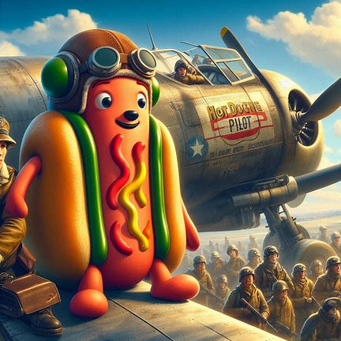

# Le Voyage Épique de Hot Dog le Pilote

Il était une fois, dans un monde où les aliments prenaient vie, un hot dog nommé Frank. Frank n’était pas un hot dog ordinaire. Il avait un rêve : devenir le premier hot dog à conduire une voiture de course.

Un jour, Frank trouva une vieille voiture de course abandonnée dans un garage. Avec un peu de bricolage et beaucoup de détermination, il réussit à la remettre en état. Il peignit la voiture en rouge vif avec des flammes jaunes sur les côtés, pour rappeler son amour pour les aventures épicées.

Frank s’entraîna jour et nuit, apprenant à maîtriser les virages serrés et les accélérations fulgurantes. Ses amis, les autres aliments, venaient souvent l’encourager. Il y avait Betty la Banane, Carl le Cornichon et Patty la Pizza, qui étaient tous impressionnés par son dévouement.

Le grand jour arriva enfin. Frank s’inscrivit à la course annuelle des aliments. La compétition était rude, avec des participants comme Tom le Taco et Sally la Salade. Mais Frank n’avait pas peur. Il savait qu’il avait travaillé dur pour ce moment.

La course commença et Frank se lança à toute vitesse. Les virages étaient serrés, mais il les prit avec aisance. À mi-parcours, il était en tête. Cependant, un obstacle inattendu apparut : une flaque de ketchup géante ! Frank fit preuve de courage et de dextérité, évitant la flaque avec une manœuvre spectaculaire.

Finalement, Frank franchit la ligne d’arrivée en premier, remportant la course et réalisant son rêve. Ses amis le portèrent en triomphe, célébrant sa victoire. Frank avait prouvé que même un hot dog pouvait accomplir de grandes choses avec de la détermination et du courage.

Et c’est ainsi que Frank le hot dog devint une légende dans le monde des aliments, inspirant d’autres à poursuivre leurs rêves, peu importe les obstacles.

### Chapitre 2 : L'Invitation Mystérieuse

Quelques mois après sa victoire, Frank reçut une lettre mystérieuse. L'enveloppe était dorée et scellée avec un emblème en forme de fourchette. À l'intérieur, il trouva une invitation à participer à une course secrète réservée aux meilleurs pilotes du monde des aliments. La course se déroulerait dans un lieu inconnu, et seuls les plus courageux osaient y participer.

Frank, toujours avide de nouvelles aventures, accepta sans hésiter. Il se prépara minutieusement, améliorant encore sa voiture et s'entraînant avec ses amis. Betty la Banane, Carl le Cornichon et Patty la Pizza l'encouragèrent et l'aidèrent à se préparer pour cette nouvelle épreuve.

.jpg)

### Chapitre 3 : Le Départ Vers l'Inconnu

Le jour du départ arriva. Frank suivit les instructions de l'invitation et se rendit à un point de rendez-vous secret. Là, il rencontra d'autres pilotes légendaires, comme Gary le Gâteau et Lucy la Lasagne. Ensemble, ils furent transportés vers un lieu mystérieux, une île cachée au milieu de l'océan.

L'île était un véritable paradis pour les courses, avec des pistes sinueuses, des obstacles naturels et des paysages à couper le souffle. Frank était émerveillé, mais il savait que la compétition serait féroce.

.jpg)

### Chapitre 4 : Les Premières Épreuves

La course secrète était composée de plusieurs épreuves, chacune plus difficile que la précédente. La première épreuve consistait à traverser une forêt dense remplie de pièges. Frank utilisa son agilité et son expérience pour éviter les obstacles et se frayer un chemin à travers les arbres.

La deuxième épreuve était une course sur une plage de sable fin, où les pilotes devaient éviter des vagues géantes et des coquillages tranchants. Frank, avec son esprit d'aventure, réussit à naviguer habilement à travers les dangers.

### Chapitre 5 : La Grande Finale

Après plusieurs jours d'épreuves intenses, Frank se retrouva en finale face à ses rivaux les plus redoutables. La dernière course se déroulait sur une piste volcanique, avec des rivières de lave et des éruptions soudaines. Frank savait que cette course serait la plus difficile de toutes.

Avec courage et détermination, il se lança sur la piste. Les virages étaient serrés, et la chaleur était intense, mais Frank ne se laissa pas décourager. Il utilisa toutes ses compétences et son expérience pour éviter les dangers et maintenir sa vitesse.

### Chapitre 6 : La Victoire Éclatante

Dans un dernier effort, Frank franchit la ligne d'arrivée en premier, remportant la course secrète et devenant le champion incontesté des pilotes alimentaires. Ses amis, qui avaient suivi ses exploits de loin, le rejoignirent pour célébrer sa victoire.

Frank avait une fois de plus prouvé que même un hot dog pouvait accomplir des exploits incroyables avec de la détermination et du courage. Il devint une légende non seulement dans le monde des aliments, mais aussi dans celui des courses.

### Chapitre 7 : Un Nouveau Départ

Après sa victoire, Frank décida de partager son expérience et d'aider d'autres aliments à réaliser leurs rêves. Il ouvrit une école de pilotage où il enseigna aux jeunes aliments les compétences nécessaires pour devenir de grands pilotes.

Frank continua à vivre de nouvelles aventures, toujours prêt à relever de nouveaux défis et à inspirer ceux qui l'entouraient. Son histoire devint une source d'inspiration pour tous, prouvant que même les rêves les plus fous peuvent devenir réalité avec de la détermination et du courage.

Et ainsi, l'épopée de Frank le hot dog continua, remplie de nouvelles aventures et de succès éclatants.

Bien sûr, je serais ravi de continuer l'histoire de Frank le hot dog pour toi ! Voici la suite :

### Chapitre 8 : L'Appel de l'Espace

Après avoir ouvert son école de pilotage et aidé de nombreux jeunes aliments à réaliser leurs rêves, Frank reçut un jour une visite inattendue. Un groupe de scientifiques alimentaires, dirigé par le Professeur Brocoli, lui proposa une mission extraordinaire : devenir le premier hot dog à voyager dans l'espace !

Frank, toujours avide de nouvelles aventures, accepta sans hésiter. Il se rendit au centre spatial où il fut formé aux techniques de pilotage spatial et aux conditions de vie dans l'espace. Ses amis, Betty la Banane, Carl le Cornichon et Patty la Pizza, l'encouragèrent et l'aidèrent à se préparer pour cette mission incroyable.

### Chapitre 9 : Le Décollage

Le jour du décollage arriva. Frank, vêtu de sa combinaison spatiale, monta à bord de la fusée "Épicé 1". Le compte à rebours commença, et bientôt, la fusée s'élança vers les étoiles. Frank ressentit une montée d'adrénaline alors qu'il quittait l'atmosphère terrestre et entrait dans l'immensité de l'espace.

### Chapitre 10 : L'Exploration de la Planète Fromage

Après plusieurs jours de voyage, Frank et son équipe atteignirent leur destination : la mystérieuse Planète Fromage. Cette planète, entièrement composée de différents types de fromage, était un véritable paradis pour les amateurs de fromage. Frank et les scientifiques commencèrent à explorer la surface, découvrant des paysages incroyables et des créatures étranges.

.jpg)

### Chapitre 11 : La Rencontre avec les Habitants

Au cours de leur exploration, Frank et son équipe rencontrèrent les habitants de la Planète Fromage, les Fromagons. Ces créatures amicales, faites de fromage fondu, accueillirent chaleureusement les visiteurs et leur montrèrent les merveilles de leur monde. Frank fut fasciné par leur culture et leurs technologies avancées.

### Chapitre 12 : Le Retour Triomphal

Après plusieurs semaines passées à explorer la Planète Fromage et à nouer des amitiés avec les Fromagons, Frank et son équipe se préparèrent à retourner sur Terre. Le voyage de retour fut sans encombre, et à leur arrivée, ils furent accueillis en héros. Frank avait une fois de plus prouvé que même un hot dog pouvait accomplir des exploits incroyables avec de la détermination et du courage.

### Chapitre 13 : Un Nouveau Défi

De retour sur Terre, Frank se rendit compte qu'il avait encore beaucoup à offrir. Inspiré par son voyage spatial, il décida de se lancer dans un nouveau défi : organiser une course intergalactique réunissant les meilleurs pilotes de toutes les planètes. Avec l'aide de ses amis et des scientifiques, il commença à planifier cet événement extraordinaire.

### Chapitre 14 : La Course Intergalactique

Le jour de la course intergalactique arriva. Des pilotes venus de toute la galaxie se rassemblèrent pour participer à cette compétition unique. Frank, en tant qu'organisateur et participant, se lança dans la course avec enthousiasme. Les pistes étaient spectaculaires, traversant des planètes, des astéroïdes et des nébuleuses colorées.

### Chapitre 15 : La Victoire Ultime

Après une série de courses palpitantes, Frank se retrouva en finale face à ses rivaux les plus redoutables. La dernière course se déroulait sur une piste traversant un champ d'astéroïdes. Avec courage et détermination, Frank utilisa toutes ses compétences pour éviter les obstacles et maintenir sa vitesse.

Dans un dernier effort, il franchit la ligne d'arrivée en premier, remportant la course intergalactique et devenant le champion incontesté de l'univers. Ses amis et les spectateurs de toutes les planètes le célébrèrent, reconnaissant son incroyable talent et sa détermination sans faille.

### Chapitre 16 : Une Nouvelle Légende

Frank le hot dog était désormais une légende non seulement sur Terre, mais aussi dans toute la galaxie. Il continua à inspirer d'autres aliments et créatures à poursuivre leurs rêves, peu importe les obstacles. Son histoire devint une source d'inspiration pour tous, prouvant que même les rêves les plus fous peuvent devenir réalité avec de la détermination et du courage.

Et ainsi, l'épopée de Frank le hot dog continua, remplie de nouvelles aventures et de succès éclatants, dans un univers où tout était possible.

